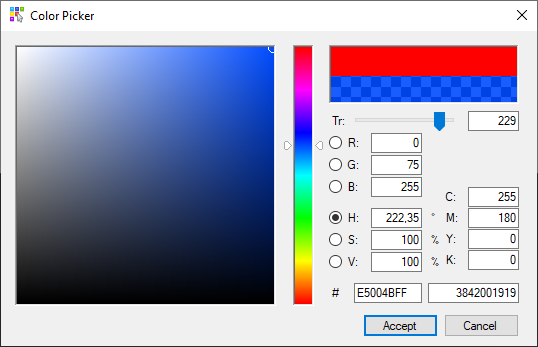

<!-- PROJECT SHIELDS -->
[![Contributors][contributors-shield]][contributors-url]
[![Forks][forks-shield]][forks-url]
[![Stargazers][stars-shield]][stars-url]
[![Issues][issues-shield]][issues-url]


<!-- PROJECT LOGO -->
<br />
<p align="center">
  <a href="https://github.com/xnaval/ColorPicker">
    
  </a>

  <h3 align="center">ColorPicker</h3>

  <p align="center">
    A Windows Form in c# to pick a Color that allows to set the transparency (alpha component)
    <br />
    <a href="https://github.com/xnaval/ColorPicker"><strong>Explore the docs »</strong></a>
    <br />
    <br />
    <a href="https://github.com/xnaval/ColorPicker">View Demo</a>
    ·
    <a href="https://github.com/xnaval/ColorPicker/issues">Report Bug</a>
    ·
    <a href="https://github.com/xnaval/ColorPicker/issues">Request Feature</a>
  </p>
</p>


<!-- TABLE OF CONTENTS -->
<details open="open">
  <summary><h2 style="display: inline-block">Table of Contents</h2></summary>
  <ol>
    <li>
      <a href="#about-the-project">About The Project</a>
      <ul>
        <li><a href="#built-with">Built With</a></li>
      </ul>
    </li>
    <li><a href="#installation">Installation</a></li>
    <li><a href="#usage">Usage</a></li>
    <li><a href="#contributing">Contributing</a></li>
    <li><a href="#contact">Contact</a></li>
    <li><a href="#acknowledgements">Acknowledgements</a></li>
  </ol>
</details>

<!-- ABOUT THE PROJECT -->
## About The Project



For a project I'm working on, I need to have a dialog that allows to select a color with transparency. After some digging in internet, I found the the Danny Blanchard's article published at https://www.codeproject.com/Articles/9959/Adobe-Color-Picker-Clone-Part-1.
So I adpated his code to my needs and here is the result, just for the case that any one finds it usefull.

### Built With

* [VisualStudio](https://visualstudio.microsoft.com/)
* c#

<!-- INSTALLATION -->
## Installation

The easiest way to install this project is to add the source files to a folder of your source code and compile it.

<!-- USAGE EXAMPLES -->
## Usage

You may look at Form1.cs file to see how to use the ColorPicker form.

Basically:
```
ColorPickerFrm frm = new ColorPickerFrm(initialColor); // Create the ColorPicker form, with the inital color.
if (frm.ShowDialog(this) == DialogResult.OK) // Open the ColorPicker form.
{
    resultColor = frm.Color; // Get the chosed color.
}
```

<!-- CONTRIBUTING -->
## Contributing

Contributions are what make the open source community such an amazing place to be learn, inspire, and create. Any contributions you make are **greatly appreciated**.

1. Fork the Project
2. Create your Feature Branch (`git checkout -b feature/AmazingFeature`)
3. Commit your Changes (`git commit -m 'Add some AmazingFeature'`)
4. Push to the Branch (`git push origin feature/AmazingFeature`)
5. Open a Pull Request

<!-- CONTACT -->
## Contact

Your Name - [@@xnaval](https://twitter.com/@xnaval) - xnaval@telefonica.net

Project Link: [https://github.com/xnaval/ColorPicker](https://github.com/xnaval/ColorPicker)

<!-- ACKNOWLEDGEMENTS -->
## Acknowledgements

* [Adobe-Color-Picker-Clone-Part-1](https://www.codeproject.com/Articles/9959/Adobe-Color-Picker-Clone-Part-1)
* [Best-README-Template](https://github.com/othneildrew/Best-README-Template)

<!-- MARKDOWN LINKS & IMAGES -->
<!-- https://www.markdownguide.org/basic-syntax/#reference-style-links -->
[contributors-shield]: https://img.shields.io/github/contributors/xnaval/repo.svg?style=for-the-badge
[contributors-url]: https://github.com/xnaval/repo/graphs/contributors
[forks-shield]: https://img.shields.io/github/forks/xnaval/repo.svg?style=for-the-badge
[forks-url]: https://github.com/xnaval/repo/network/members
[stars-shield]: https://img.shields.io/github/stars/xnaval/repo.svg?style=for-the-badge
[stars-url]: https://github.com/xnaval/repo/stargazers
[issues-shield]: https://img.shields.io/github/issues/xnaval/repo.svg?style=for-the-badge
[issues-url]: https://github.com/xnaval/repo/issues
